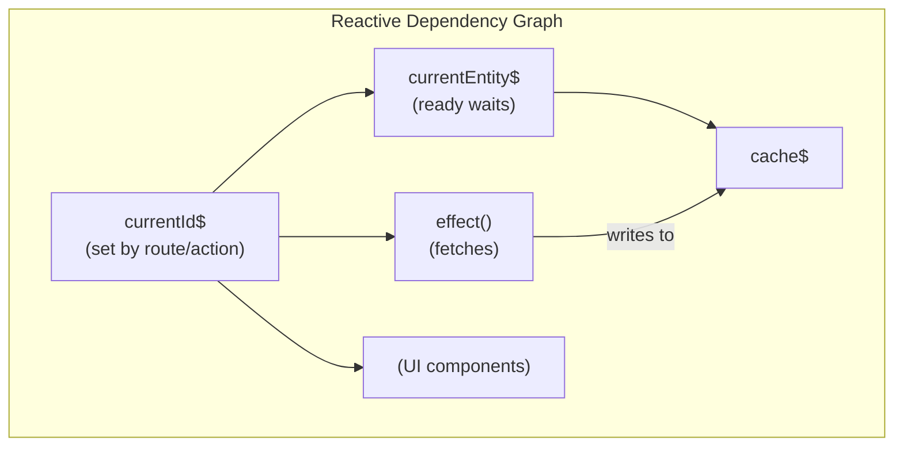

# Deferred Entity Loading Pattern

Complete pattern for route-based entity loading with Suspense integration.

## Overview



## Complete Implementation

```typescript
import { atom, derived, effect, readonly, define } from "atomirx";

interface Article {
  id: string;
  title: string;
  content: string;
}

/**
 * @store articleStore
 *
 * @atoms
 * - currentArticleId$ - The ID from route params
 * - articleCache$ - Normalized cache of fetched articles
 * - currentArticle$ - Derived: current article (suspends via ready())
 *
 * @effects
 * - Auto-fetches article when ID changes and not cached
 *
 * @actions
 * - navigateTo(id) - Navigate to article
 * - invalidate(id) - Mark article stale (won't disrupt current view)
 * - refresh() - Force refetch current article
 *
 * @reactive-flow
 * navigateTo(id) → currentArticleId$ → [currentArticle$ suspends] + [effect fetches]
 *                                     → articleCache$ updated → currentArticle$ resolves
 */
const articleStore = define(() => {
  // Current article ID - set from route
  const currentArticleId$ = atom<string | undefined>(undefined);

  // Article cache - normalized storage
  const articleCache$ = atom<Record<string, Article>>({});

  // Current article - uses ready() to wait for both ID and cached data
  const currentArticle$ = derived(({ ready }) => {
    const id = ready(currentArticleId$);
    return ready(articleCache$, (cache) => cache[id]);
  });

  // Fetch article when ID changes
  effect(({ read }) => {
    const id = read(currentArticleId$);
    if (!id) return;

    const cache = read(articleCache$);
    if (cache[id]) return;

    fetch(`/api/articles/${id}`)
      .then((r) => r.json())
      .then((article) => {
        articleCache$.set((prev) => ({ ...prev, [id]: article }));
      });
  });

  return {
    ...readonly({ currentArticleId$, currentArticle$ }),

    // Navigate to article
    // Flow: Set ID → derived suspends (if not cached) → effect fetches → cache updated → UI shows
    navigateTo: (id: string) => currentArticleId$.set(id),

    // Soft invalidation - won't disrupt current view
    // Flow: Remove from cache → next navigateTo will refetch
    invalidate: (id: string) => {
      if (id === currentArticleId$.get()) return;
      articleCache$.set((prev) => {
        const { [id]: _, ...rest } = prev;
        return rest;
      });
    },

    // Hard refresh - shows skeleton, refetches
    // Flow: Remove current from cache → derived suspends → effect fetches → UI shows fresh
    refresh() {
      articleCache$.set((prev) => {
        const { [currentArticleId$.get()]: _, ...rest } = prev;
        return rest;
      });
    },
  };
});
```

## Action Flows

### navigateTo(id)

```
1. currentArticleId$.set(id)
2. currentArticle$ recomputes:
   - If cached: ready() succeeds → UI shows immediately
   - If not cached: ready() suspends → UI shows <Skeleton />
3. effect() runs in parallel:
   - If cached: early return
   - If not cached: fetch → update cache
4. When cache updated, currentArticle$ resolves → UI shows data
```

### invalidate(id)

```
1. Guard: Skip if id === currentArticleId (don't disrupt view)
2. Remove article from cache
3. No immediate UI effect
4. Next navigateTo(id) will trigger fresh fetch
```

### refresh()

```
1. Remove current article from cache
2. currentArticle$ suspends → UI shows <Skeleton />
3. effect() detects cache miss → fetches
4. Cache updated → UI shows fresh data
```

## React Integration

```tsx
function ArticlePage() {
  const { navigateTo } = articleStore();
  const { id } = useParams();

  useEffect(() => {
    navigateTo(id);
  }, [id]);

  return (
    <Suspense fallback={<ArticleSkeleton />}>
      <ArticleContent />
    </Suspense>
  );
}

function ArticleContent() {
  const article = useSelector(articleStore().currentArticle$);
  return (
    <article>
      <h1>{article.title}</h1>
      <p>{article.content}</p>
    </article>
  );
}
```

## Extended: With Loading/Error States

For more control beyond Suspense:

```typescript
type CacheEntry<T> =
  | { status: "loading" }
  | { status: "error"; error: Error }
  | { status: "success"; data: T };

const articleCache$ = atom<Record<string, CacheEntry<Article>>>({});

effect(({ read }) => {
  const id = read(currentArticleId$);
  if (!id) return;

  const cache = read(articleCache$);
  if (cache[id]) return;

  articleCache$.set((prev) => ({ ...prev, [id]: { status: "loading" } }));

  fetch(`/api/articles/${id}`)
    .then((r) => r.json())
    .then((article) =>
      articleCache$.set((prev) => ({
        ...prev,
        [id]: { status: "success", data: article },
      }))
    )
    .catch((error) =>
      articleCache$.set((prev) => ({
        ...prev,
        [id]: { status: "error", error },
      }))
    );
});
```
