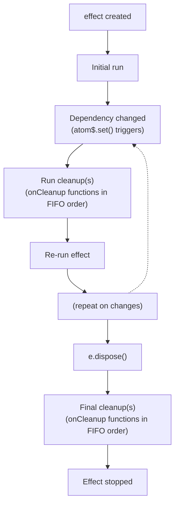

# Core Concepts

This guide covers the fundamental building blocks of atomirx.

## Table of Contents

- [Atoms](#atoms)
- [Derived Atoms](#derived-atoms)
- [Effects](#effects)
- [Events](#events)
- [Pools](#pools)
- [Batching](#batching)
- [Modules (define)](#modules-define)

---

## Atoms

Atoms are the foundational primitive - reactive containers that hold a single value.

### Creating Atoms

```ts
import { atom } from "atomirx";

// Simple value
const count$ = atom(0);
const name$ = atom("John");
const user$ = atom({ id: 1, name: "John" });

// Lazy initialization (function is called at creation)
const timestamp$ = atom(() => Date.now());

// Async value (stores the Promise)
const data$ = atom(fetch("/api/data").then((r) => r.json()));
```

### Reading Values

```ts
const count$ = atom(5);

// Synchronous read
count$.get(); // 5

// For async atoms, get() returns the Promise
const data$ = atom(fetchData());
data$.get(); // Promise<Data>
```

### Updating Values

```ts
const count$ = atom(0);

// Direct value
count$.set(5);

// Reducer function (receives previous value)
count$.set((prev) => prev + 1);

// Reset to initial value
count$.reset();
```

### Subscribing to Changes

```ts
const count$ = atom(0);

// Subscribe returns unsubscribe function
const unsubscribe = count$.on(() => {
  console.log("Count changed to:", count$.get());
});

count$.set(1); // Logs: "Count changed to: 1"

// Stop listening
unsubscribe();
```

### Atom Context

When using lazy initialization, atoms receive a context object:

```ts
const data$ = atom((context) => {
  // AbortSignal - aborted when value changes or reset
  const signal = context.signal;

  // Register cleanup functions
  context.onCleanup(() => {
    console.log("Cleaning up...");
  });

  return fetchData({ signal });
});
```

### Dirty State

Track if an atom has been modified since creation or last reset:

```ts
const count$ = atom(0);

count$.dirty(); // false
count$.set(1);
count$.dirty(); // true
count$.reset();
count$.dirty(); // false
```

### Atom Options

```ts
const count$ = atom(0, {
  // Metadata for debugging/devtools
  meta: { key: "counter" },

  // Equality function to prevent unnecessary notifications
  equals: "shallow", // or 'strict', 'deep', or custom function
});
```

### Read-Only Exposure

Use `readonly()` to expose atoms without mutation methods:

```ts
import { atom, readonly } from "atomirx";

const count$ = atom(0);

// Type is Atom<number> - no set() or reset()
export const publicCount$ = readonly(count$);
```

---

## Derived Atoms

Derived atoms compute values from other atoms with automatic dependency tracking.

### IMPORTANT: Derived Value is Always a Promise

**The `.get()` method of a derived atom ALWAYS returns a `Promise<T>`**, even for synchronous computations. This is by design:

- **Unified async handling** - Derived atoms seamlessly handle both sync and async dependency atoms
- **Reactive composition** - Use `derived()` when you need to reactively combine multiple atoms
- **Suspense integration** - The Promise-based API enables React Suspense support

### Creating Derived Atoms

```ts
import { derived } from "atomirx";

const firstName$ = atom("John");
const lastName$ = atom("Doe");

const fullName$ = derived(
  ({ read }) => `${read(firstName$)} ${read(lastName$)}`
);
```

### Reading Derived Values

Derived atoms always return Promises:

```ts
// Async access
await fullName$.get(); // "John Doe"

// Synchronous access (may be undefined before first computation)
fullName$.staleValue; // "John Doe" | undefined
```

### State Access

```ts
const state = fullName$.state();

switch (state.status) {
  case "loading":
    console.log("Computing...", state.promise);
    break;
  case "ready":
    console.log("Value:", state.value);
    break;
  case "error":
    console.log("Error:", state.error);
    break;
}
```

### Fallback Values

Provide a fallback for guaranteed synchronous access:

```ts
// Without fallback
const count$ = derived(({ read }) => read(items$).length);
count$.staleValue; // number | undefined

// With fallback
const countSafe$ = derived(({ read }) => read(items$).length, { fallback: 0 });
countSafe$.staleValue; // number (always defined)
```

### Refresh

Force recomputation:

```ts
fullName$.refresh();
```

### Conditional Dependencies

Only atoms accessed via `read()` become dependencies:

```ts
const showDetails$ = atom(false);
const summary$ = atom("Brief");
const details$ = atom("Detailed");

const content$ = derived(({ read }) => {
  if (read(showDetails$)) {
    return read(details$); // Only subscribes when showDetails is true
  }
  return read(summary$);
});
```

### Boolean Operators: and() / or()

Use `and()` and `or()` for composable boolean logic with short-circuit evaluation:

```ts
// and() - all must be truthy
const canAccess$ = derived(({ and }) =>
  and([isLoggedIn$, hasPermission$, isActive$])
);

// or() - any truthy is enough
const hasData$ = derived(({ or }) => or([cacheData$, apiData$, fallbackData$]));
```

**Condition types:**

- `boolean` - Static value (no subscription)
- `Atom<T>` - Always read and subscribed
- `() => boolean | Atom<T>` - Lazy, only evaluated if needed

**Lazy evaluation for performance:**

```ts
const canDelete$ = derived(({ and }) =>
  and([
    isLoggedIn$, // Always checked first
    () => hasDeleteRole$, // Only checked if logged in
    () => canDeleteItem$, // Only checked if has role
  ])
);
```

**Nested composition:**

```ts
// Complex: feature && loggedIn && (hasPermission || isAdmin)
const canAccess$ = derived(({ and, or }) =>
  and([
    FEATURE_ENABLED, // Static config
    isLoggedIn$,
    or([hasPermission$, isAdmin$]),
  ])
);
```

### CRITICAL: Never Update Atoms in Derived

**Derived is for pure computation only.** Never call `.set()` on any atom inside a derived selector:

```ts
// ❌ FORBIDDEN - Don't update atoms in derived
derived(({ read }) => {
  const items = read(cartItems$);
  const total = items.reduce((sum, i) => sum + i.price, 0);
  cartTotal$.set(total); // ❌ NEVER DO THIS
  return total;
});

// ✅ CORRECT - Use effect() when you need to update atoms reactively
effect(
  ({ read }) => {
    const items = read(cartItems$);
    const total = items.reduce((sum, i) => sum + i.price, 0);
    cartTotal$.set(total); // ✅ OK in effect
  },
  { meta: { key: "compute.cartTotal" } }
);

// ✅ CORRECT - Derived is pure computation only
const cartTotal$ = derived(({ read }) => {
  const items = read(cartItems$);
  return items.reduce((sum, i) => sum + i.price, 0);
});
```

**Why this matters:**

- Derived selectors may re-run multiple times during a single update cycle
- Updating atoms inside derived causes infinite loops and unpredictable behavior
- Derived is for **reading and transforming**, not for **writing**

### Optimize Multiple Reads with all()

When reading multiple atoms, use `all()` instead of sequential `read()` calls:

```ts
// ❌ INEFFICIENT - Sequential reads cause multiple re-evaluations
const dashboard$ = derived(({ read }) => {
  const user = read(user$); // Re-eval #1 if loading
  const posts = read(posts$); // Re-eval #2 if loading
  return { user, posts };
});

// ✅ OPTIMIZED - all() combines into single wait
const dashboard$ = derived(({ all }) => {
  const [user, posts] = all([user$, posts$]);
  // Single combined Promise, waits for ALL at once
  return { user, posts };
});
```

---

## Effects

Effects run side effects in response to atom changes. Effects handle sync/async atom values, then execute synchronously.

### Effect Handles Sync/Async, Then Executes Synchronously

Effects are responsible for:

1. **Handling sync/async values** - `read()` suspends until async atoms resolve
2. **Executing synchronously** - Once values are available, the effect body runs synchronously
3. **Performing side effects** - Logging, updating external state, persisting, or mutating other atoms

```ts
const user$ = atom(fetchUser()); // Async atom
const preferences$ = atom({ theme: "dark" }); // Sync atom

// Effect handles both sync and async, then executes synchronously
effect(
  ({ read }) => {
    const user = read(user$); // Suspends until resolved
    const prefs = read(preferences$); // Reads immediately

    // Synchronous execution after all values resolved
    console.log(`User ${user.name} prefers ${prefs.theme}`);
    localStorage.setItem("lastUser", user.id);
  },
  { meta: { key: "log.userPrefs" } }
);
```

### Creating Effects

```ts
import { effect } from "atomirx";

const dispose = effect(({ read }) => {
  const count = read(count$);
  localStorage.setItem("count", String(count));
});

// Stop the effect
dispose();
```

### Cleanup

Register cleanup functions that run before each re-execution and on dispose:

```ts
effect(({ read, onCleanup }) => {
  const interval = read(intervalMs$);

  const id = setInterval(() => {
    console.log("tick");
  }, interval);

  onCleanup(() => {
    clearInterval(id);
  });
});
```

### AbortSignal

Effects provide a `signal` for cancelling async operations. The signal is automatically aborted when the effect re-runs or is disposed:

```ts
effect(({ read, signal }) => {
  const userId = read(userId$);

  // Fetch is cancelled if userId changes or effect disposes
  fetch(`/api/users/${userId}`, { signal })
    .then((r) => r.json())
    .then((user) => user$.set(user))
    .catch((err) => {
      // Ignore abort errors
      if (err.name !== "AbortError") throw err;
    });
});
```

You can also manually abort using the `abort()` method:

```ts
effect(({ read, signal, abort }) => {
  const shouldCancel = read(shouldCancel$);
  if (shouldCancel) {
    abort();
    return;
  }

  fetch("/api/data", { signal });
});
```

### Error Handling

```ts
effect(
  ({ read }) => {
    const data = read(data$);
    riskyOperation(data);
  },
  {
    onError: (error) => {
      console.error("Effect failed:", error);
    },
  }
);
```

### Effect Lifecycle



---

## Events

Events are reactive signals that block computation until fired. They're useful for user-driven workflows where you want to suspend processing until a specific action occurs.

### Creating Events

```ts
import { event } from "atomirx";

// Typed event with payload
const submitEvent = event<FormData>({ meta: { key: "form.submit" } });

// Void event (no payload)
const cancelEvent = event({ meta: { key: "form.cancel" } });

// With equality (dedupe identical payloads)
const searchEvent = event<string>({
  equals: "shallow",
  meta: { key: "search.query" },
});
```

### Firing Events

```ts
// Fire with payload
submitEvent.fire(formData);

// Fire void event
cancelEvent.fire();

// Get last fired payload
submitEvent.last(); // FormData | undefined
```

### Events in Derived (Block Until Fire)

Events work directly with `read()` - computation suspends until `fire()` is called:

```ts
const result$ = derived(({ read }) => {
  const data = read(submitEvent); // Suspends until fire()
  return processForm(data);
});

// Initially loading
result$.state().status; // "loading"

// After fire
submitEvent.fire(formData);
await result$.get(); // processForm result
```

### Events in Effect

Effects also suspend until events fire:

```ts
effect(({ read }) => {
  const data = read(submitEvent); // Suspends until fire()
  console.log("Form submitted:", data);
  localStorage.setItem("lastSubmission", JSON.stringify(data));
});
```

### Race Multiple Events

Use `race()` to respond to whichever event fires first:

```ts
const outcome$ = derived(({ race }) => {
  const { key, value } = race({
    submit: submitEvent,
    cancel: cancelEvent,
  });

  if (key === "cancel") {
    return { cancelled: true, data: null };
  }
  return { cancelled: false, data: processForm(value) };
});
```

### Wait for Multiple Events

Use `all()` to wait for all events to fire:

```ts
const combined$ = derived(({ all }) => {
  const [user, settings] = all([userSelectedEvent, settingsLoadedEvent]);
  return { user, settings };
});
```

### Reactive Updates

After the first fire, subsequent fires trigger reactive updates:

```ts
const clickEvent = event<{ x: number; y: number }>();

const lastClick$ = derived(({ read }) => {
  return read(clickEvent); // Re-computes on each fire
});

clickEvent.fire({ x: 100, y: 200 }); // First fire - resolves
clickEvent.fire({ x: 150, y: 250 }); // Second fire - derived re-computes
```

### Equality Option

Use `equals` to skip duplicate payloads:

```ts
const searchEvent = event<string>({ equals: "shallow" });

searchEvent.fire("hello"); // Creates promise, resolves
searchEvent.fire("hello"); // Skipped (same value)
searchEvent.fire("world"); // New promise, triggers updates
```

**Default equals is `() => false`** - every fire triggers an update. This is important for void events where multiple fires should all be meaningful.

### Event API

| Method/Property | Description |
|-----------------|-------------|
| `fire(payload)` | Fire the event with payload |
| `get()` | Get current promise |
| `on(listener)` | Subscribe to promise changes |
| `last()` | Get last fired payload |
| `meta` | Optional metadata |

### Mental Model: staleValue for User Actions

Think of events like atoms where you're waiting for the `staleValue` to become available:

```ts
// Event is like: "wait for user to provide a value"
const submitEvent = event<FormData>();

// read(event) = "give me the value once user fires it"
const result$ = derived(({ read }) => {
  const data = read(submitEvent); // Like waiting for staleValue
  return processForm(data);
});
```

### When to Use Events

| Scenario | Use Event? | Why |
|----------|------------|-----|
| Block until user clicks | ✅ Yes | Suspend until action |
| Form submission gating | ✅ Yes | Wait for submit |
| Cancel/confirm dialogs | ✅ Yes | Race submit vs cancel |
| Timeout a fetch request | ❌ No | Use `abortable()` or Promise patterns |
| Retry logic | ❌ No | Use async atoms |
| Continuous data stream | ❌ No | Use atom instead |

**Events are NOT for promise flow control** (timeouts, retries, cancellation). They're specifically for **user-driven signals** that gate computation.

---

## When to Use What

### Decision Rules

| Scenario                                  | Solution                     | Why                        |
| ----------------------------------------- | ---------------------------- | -------------------------- |
| User clicks button → modify atoms         | Plain function with `.set()` | User-triggered, imperative |
| React to atom changes → compute new value | `derived()`                  | Reactive computation       |
| React to atom changes → side effects      | `effect()`                   | Reactive side effects      |
| Need to combine multiple sync/async atoms | `derived()`                  | Handles async uniformly    |
| Need to persist/log/sync on changes       | `effect()`                   | Side effect execution      |

### Plain Functions for User Actions

When a user action triggers atom modifications, write a plain function:

```ts
// ✅ CORRECT - User action triggers atom updates
function addTodo(text: string) {
  todos$.set((prev) => [...prev, { id: Date.now(), text, completed: false }]);
}

function toggleTodo(id: number) {
  todos$.set((prev) =>
    prev.map((t) => (t.id === id ? { ...t, completed: !t.completed } : t))
  );
}

// Usage in React
<button onClick={() => addTodo("New task")}>Add</button>
```

### Derived for Reactive Computation

When you need to compute values that update when dependencies change:

```ts
// ✅ CORRECT - Reactive computation from multiple atoms
const filteredTodos$ = derived(({ read }) => {
  const todos = read(todos$); // May be sync or async
  const filter = read(filterType$); // May be sync or async
  return todos.filter(
    (t) => filter === "all" || t.completed === (filter === "completed")
  );
});
```

### Effect for Reactive Side Effects

When you need to perform side effects when atoms change:

```ts
// ✅ CORRECT - React to changes, perform side effect
effect(
  ({ read }) => {
    const todos = read(todos$);
    localStorage.setItem("todos", JSON.stringify(todos));
  },
  { meta: { key: "persist.todos" } }
);

// ✅ CORRECT - Effect can also mutate atoms
effect(
  ({ read }) => {
    const items = read(cartItems$);
    const total = items.reduce((sum, i) => sum + i.price, 0);
    cartTotal$.set(total);
  },
  { meta: { key: "compute.cartTotal" } }
);
```

### Comparison Table

| Aspect            | derived()                | effect()                   |
| ----------------- | ------------------------ | -------------------------- |
| Returns           | `Promise<T>` (computed)  | void (side effects only)   |
| Lazy              | Yes (computed on access) | No (runs immediately)      |
| Subscription      | When accessed            | Always active              |
| Use case          | Transform/combine data   | Sync, persist, log, mutate |
| **Can set atoms** | **❌ NEVER**             | **✅ Yes**                 |
| Async handling    | Suspends until resolved  | Suspends until resolved    |

---

## Pools

Pools are parameterized collections of atoms with automatic garbage collection.

### Creating Pools

```ts
import { pool } from "atomirx";

const userPool = pool((id: string) => fetchUser(id), {
  gcTime: 60_000, // GC after 60s of inactivity
  equals: "shallow", // Params equality
});
```

### Using Pools

```ts
// Get value
const user = userPool.get("user-1");

// Set value
userPool.set("user-1", { name: "John" });

// Check existence
userPool.has("user-1"); // true

// Remove entry
userPool.remove("user-1");

// Clear all
userPool.clear();

// Iterate
userPool.forEach((value, params) => {
  console.log(params, value);
});
```

### Pool Events

```ts
// Subscribe to all pool events
userPool.on((event) => {
  switch (event.type) {
    case "create":
      console.log("Created:", event.params, event.value);
      break;
    case "change":
      console.log("Changed:", event.params, event.value);
      break;
    case "remove":
      console.log("Removed:", event.params, event.value);
      break;
  }
});
```

### Pool in Reactive Context

Use `from()` to safely access pool entries in derived/effect/useSelector:

```ts
const userPosts$ = derived(({ read, from }) => {
  const userId = read(currentUserId$);
  const user$ = from(userPool, userId); // Creates ScopedAtom
  return read(user$).posts;
});
```

The ScopedAtom is automatically cleaned up after the computation, preventing memory leaks.

---

## Batching

Batch multiple updates into a single notification cycle.

```ts
import { batch } from "atomirx";

const a$ = atom(0);
const b$ = atom(0);

// Without batch: 2 notifications
a$.set(1);
b$.set(2);

// With batch: 1 notification
batch(() => {
  a$.set(1);
  b$.set(2);
});
```

### Nested Batches

Inner batches are merged into the outer:

```ts
batch(() => {
  a$.set(1);
  batch(() => {
    b$.set(2);
    c$.set(3);
  });
  d$.set(4);
}); // Single notification at the end
```

### Return Values

```ts
const result = batch(() => {
  count$.set(10);
  return count$.get() * 2;
});
console.log(result); // 20
```

---

## Modules (define)

Create swappable lazy singleton stores.

### Creating Modules

```ts
import { define, atom, readonly } from "atomirx";

const counterModule = define(() => {
  const count$ = atom(0);

  return {
    count$: readonly(count$),
    increment: () => count$.set((c) => c + 1),
    decrement: () => count$.set((c) => c - 1),
    reset: () => count$.reset(),
  };
});
```

### Using Modules

```ts
// Call to get the singleton instance
const { count$, increment } = counterModule();

increment();
console.log(count$.get()); // 1
```

### Override for Testing

```ts
// Must be called BEFORE first access
counterModule.override(() => ({
  count$: atom(999),
  increment: vi.fn(),
  decrement: vi.fn(),
  reset: vi.fn(),
}));

// Reset to original
counterModule.reset();
```

### Extend Original

```ts
counterModule.override((original) => ({
  ...original(),
  doubleIncrement: () => {
    original().increment();
    original().increment();
  },
}));
```

### Module State

```ts
counterModule.isInitialized(); // Has instance been created?
counterModule.isOverridden(); // Is override active?

// Force new instance on next access
counterModule.invalidate();
```

### Cleanup on Invalidate

If the module returns a `dispose` function, it's called on invalidate:

```ts
const connectionModule = define(() => {
  const conn = createConnection();

  return {
    query: (sql) => conn.query(sql),
    dispose: () => conn.close(),
  };
});

connectionModule.invalidate(); // Calls dispose(), next access creates new
```

---

## Next Steps

- [React Guide](./react-guide.md) - React integration
- [Async Patterns](./async-patterns.md) - Handling async operations
- [API Reference](./api-reference.md) - Complete API documentation
