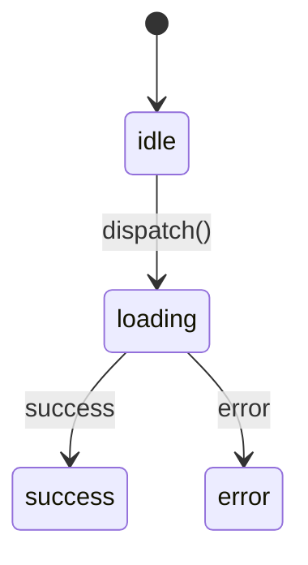
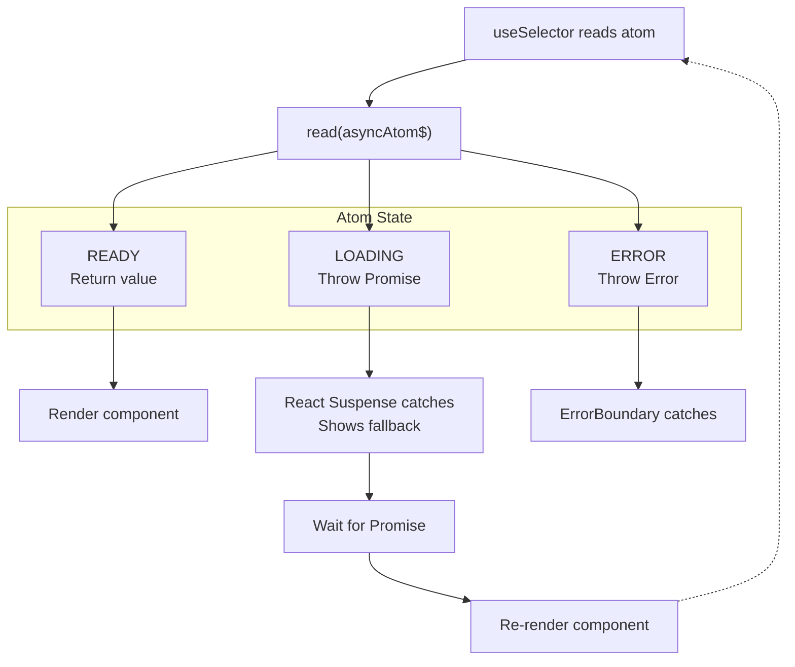

# React Integration Guide

Complete guide to using atomirx with React.

## Table of Contents

- [Installation](#installation)
- [useSelector](#useselector)
- [rx Component](#rx-component)
- [useAction](#useaction)
- [useStable](#usestable)
- [Suspense & Error Boundaries](#suspense--error-boundaries)
- [Best Practices](#best-practices)

---

## Installation

atomirx exports React-specific utilities from a separate entry point:

```ts
// Core (framework-agnostic)
import { atom, derived, effect } from "atomirx";

// React integration
import { useSelector, rx, useAction, useStable } from "atomirx/react";
```

---

## useSelector

React hook for subscribing to atom values.

### Basic Usage

```tsx
import { atom } from "atomirx";
import { useSelector } from "atomirx/react";

const count$ = atom(0);

function Counter() {
  const count = useSelector(count$);
  return <div>{count}</div>;
}
```

### With Selector Function

Derive values using the select context:

```tsx
const firstName$ = atom("John");
const lastName$ = atom("Doe");

function FullName() {
  const fullName = useSelector(
    ({ read }) => `${read(firstName$)} ${read(lastName$)}`
  );
  return <div>{fullName}</div>;
}
```

### Multiple Atoms

```tsx
function Dashboard() {
  const data = useSelector(({ read }) => ({
    count: read(count$),
    name: read(name$),
    items: read(items$),
  }));

  return (
    <div>
      <p>
        {data.name}: {data.count}
      </p>
      <p>Items: {data.items.length}</p>
    </div>
  );
}
```

### Async Atoms

For async atoms, `useSelector` uses Suspense:

```tsx
const user$ = atom(fetchUser());

function UserProfile() {
  // Throws Promise while loading (handled by Suspense)
  const user = useSelector(user$);
  return <div>{user.name}</div>;
}

// Must wrap with Suspense
function App() {
  return (
    <Suspense fallback={<Loading />}>
      <UserProfile />
    </Suspense>
  );
}
```

### Custom Equality

Control re-renders with equality functions:

```tsx
// Shallow equality (default)
const user = useSelector(user$);

// Strict equality
const user = useSelector(user$, "strict");

// Deep equality
const user = useSelector(user$, "deep");

// Custom equality
const user = useSelector(user$, (a, b) => a.id === b.id);
```

### Async Utilities

Use async utilities for multiple async atoms:

```tsx
function Dashboard() {
  const data = useSelector(({ all }) => {
    const [user, posts] = all([user$, posts$]);
    return { user, posts };
  });

  return <DashboardContent {...data} />;
}
```

### Optimize Multiple Reads with all()

When reading multiple atoms, **always prefer `all()` over sequential `read()` calls**:

```tsx
// ❌ INEFFICIENT - Sequential reads cause multiple re-renders
function Dashboard() {
  const data = useSelector(({ read }) => {
    const user = read(user$); // Re-render #1 if loading
    const posts = read(posts$); // Re-render #2 if loading
    return { user, posts };
  });
}

// ✅ OPTIMIZED - all() waits for all at once
function Dashboard() {
  const data = useSelector(({ all }) => {
    const [user, posts] = all([user$, posts$]);
    // Single Suspense boundary, single re-render
    return { user, posts };
  });
}
```

| Pattern             | Re-renders             | Wait Strategy    |
| ------------------- | ---------------------- | ---------------- |
| Sequential `read()` | Up to N (one per atom) | Waterfall (slow) |
| `all([...])`        | 1                      | Parallel (fast)  |

---

## rx Component

Inline reactive component for fine-grained updates.

### Why rx?

Without `rx`, you need separate components for each subscription:

```tsx
// Without rx
function CounterValue() {
  const count = useSelector(count$);
  return <>{count}</>;
}

function Counter() {
  return (
    <div>
      Count: <CounterValue />
    </div>
  );
}
```

With `rx`, subscribe inline:

```tsx
// With rx
function Counter() {
  return <div>Count: {rx(count$)}</div>;
}
```

### Basic Usage

```tsx
import { rx } from "atomirx/react";

function Counter() {
  return (
    <div>
      Count: {rx(count$)}
      Doubled: {rx(({ read }) => read(count$) * 2)}
    </div>
  );
}
```

### Fine-Grained Updates

Only the `rx` component re-renders, not the parent:

```tsx
function Parent() {
  console.log("Parent renders once");

  return (
    <div>
      {rx(count$)} {/* Only this re-renders */}
      <button onClick={() => count$.set((c) => c + 1)}>+</button>
    </div>
  );
}
```

### With Loading/Error Handling

```tsx
{
  rx(({ read }) => read(asyncData$), {
    loading: () => <Spinner />,
    error: ({ error }) => <ErrorMessage error={error} />,
  });
}
```

### Memoization Control

```tsx
// No memoization (recreated every render)
{
  rx(({ read }) => read(count$) * multiplier);
}

// Stable selector (never recreated)
{
  rx(({ read }) => read(count$) * 2, { deps: [] });
}

// Recreate when dependencies change
{
  rx(({ read }) => read(count$) * multiplier, { deps: [multiplier] });
}
```

### Important: Value Must Be ReactNode

When using atom shorthand, the value must be renderable:

```tsx
// ✅ OK - number is ReactNode
const count$ = atom(5);
{
  rx(count$);
}

// ❌ Wrong - object is not ReactNode
const user$ = atom({ name: "John" });
{
  rx(user$);
} // Error!

// ✅ OK - extract renderable value
{
  rx(({ read }) => read(user$).name);
}
```

---

## useAction

Hook for managing async operations with state tracking.

### Basic Usage

```tsx
import { useAction } from "atomirx/react";

function SaveButton() {
  const [save, state] = useAction(async (data: FormData) => {
    return await api.save(data);
  });

  return (
    <div>
      <button
        onClick={() => save(formData)}
        disabled={state.status === "loading"}
      >
        {state.status === "loading" ? "Saving..." : "Save"}
      </button>

      {state.status === "error" && <p>Error: {state.error.message}</p>}

      {state.status === "success" && <p>Saved! ID: {state.data.id}</p>}
    </div>
  );
}
```

### Action States

```ts
type ActionState<T> =
  | { status: "idle" }
  | { status: "loading"; promise: Promise<T> }
  | { status: "success"; data: T }
  | { status: "error"; error: Error };
```

### State Machine



### Cancellation

```tsx
function Search() {
  const [search, state, cancel] = useAction(
    async (query: string, { signal }) => {
      return await api.search(query, { signal });
    }
  );

  return (
    <div>
      <input onChange={(e) => search(e.target.value)} />
      {state.status === "loading" && <button onClick={cancel}>Cancel</button>}
    </div>
  );
}
```

### Options

```tsx
const [action, state] = useAction(
  async (data) => { ... },
  {
    // Callback on success
    onSuccess: (result) => {
      toast.success('Saved!');
    },

    // Callback on error
    onError: (error) => {
      toast.error(error.message);
    },

    // Reset state after success (ms)
    resetOnSuccess: 3000,

    // Reset state after error (ms)
    resetOnError: 5000,
  }
);
```

---

## useStable

Utilities for creating stable references.

### Stable Functions

```tsx
import { useStable } from "atomirx/react";

function Component({ onSave }) {
  // Reference stays the same, always calls latest onSave
  const handleSave = useStable.fn(() => {
    onSave(data);
  });

  return <Child onSave={handleSave} />;
}
```

### Stable Objects

```tsx
function Component() {
  // Reference stays the same, values update
  const config = useStable.obj({
    timeout: 5000,
    retries: 3,
  });

  return <Child config={config} />;
}
```

---

## Suspense & Error Boundaries

### How Suspense Works

When a selector reads an async atom that is still loading, it **throws a Promise**. React catches this Promise, shows the fallback, waits for resolution, then re-renders.



### Async Atoms with Suspense

```tsx
const user$ = atom(fetchUser());

function UserProfile() {
  const user = useSelector(user$);
  return <div>{user.name}</div>;
}

function App() {
  return (
    <ErrorBoundary fallback={<Error />}>
      <Suspense fallback={<Loading />}>
        <UserProfile />
      </Suspense>
    </ErrorBoundary>
  );
}
```

### Nested Suspense

```tsx
function Dashboard() {
  return (
    <div>
      <Suspense fallback={<HeaderSkeleton />}>
        <Header />
      </Suspense>

      <Suspense fallback={<ContentSkeleton />}>
        <Content />
      </Suspense>

      <Suspense fallback={<SidebarSkeleton />}>
        <Sidebar />
      </Suspense>
    </div>
  );
}
```

### Error Handling with safe()

Never use try/catch with `read()` - it catches Suspense promises:

```tsx
// ❌ Wrong - catches Suspense Promise
useSelector(({ read }) => {
  try {
    return read(asyncAtom$);
  } catch (e) {
    return null; // Catches loading Promise too!
  }
});

// ✅ Correct - use safe()
useSelector(({ read, safe }) => {
  const [error, data] = safe(() => read(asyncAtom$));
  if (error) return { error: error.message };
  return { data };
});
```

---

## Best Practices

### 1. Colocate Atoms Near Usage

```tsx
// Good - atoms defined near components that use them
// features/counter/atoms.ts
export const count$ = atom(0);

// features/counter/Counter.tsx
import { count$ } from "./atoms";
```

### 2. Use Modules for Complex State

```tsx
const counterModule = define(() => {
  const count$ = atom(0);

  return {
    count$: readonly(count$),
    increment: () => count$.set((c) => c + 1),
  };
});
```

### 3. Prefer rx for Fine-Grained Updates

```tsx
// Better - only count re-renders
function Counter() {
  return <div>Count: {rx(count$)}</div>;
}

// Worse - entire component re-renders
function Counter() {
  const count = useSelector(count$);
  return <div>Count: {count}</div>;
}
```

### 4. Use Derived for Computed Values

```tsx
// Good - computed once, cached
const total$ = derived(({ read }) =>
  read(items$).reduce((sum, i) => sum + i.price, 0)
);

// Avoid - computed on every render
function Total() {
  const items = useSelector(items$);
  const total = items.reduce((sum, i) => sum + i.price, 0);
  return <span>{total}</span>;
}
```

### 5. Batch Related Updates

```tsx
function handleSubmit() {
  batch(() => {
    firstName$.set(form.firstName);
    lastName$.set(form.lastName);
    email$.set(form.email);
  });
}
```

### 6. Proper Error Boundaries

```tsx
function App() {
  return (
    <ErrorBoundary fallback={<AppError />}>
      <Suspense fallback={<AppLoading />}>
        <Routes />
      </Suspense>
    </ErrorBoundary>
  );
}
```

---

## Next Steps

- [Async Patterns](./async-patterns.md) - Advanced async handling
- [Testing](./testing.md) - Testing strategies
- [API Reference](./api-reference.md) - Complete API docs
